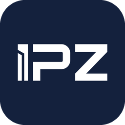

# IPZ – IP Tarayıcı

<br clear="left">

Geliştiren: **Kutluhan** – [IPZ PROJE](https://ipzproje.com.tr) (Innovative Projects Zone)

Windows için basit ve hızlı bir ağ tarayıcısı. Ağdaki cihazları bulur, adlarını, MAC adreslerini,
üreticilerini ve açık portlarını gösterir. Bulunan cihaza tek tıkla web tarayıcı, Telnet, SSH,
Uzak Masaüstü veya paylaşılan klasörlerle bağlanabilirsiniz.

## İndirme

[Releases](../../releases) sayfasındaki **Son sürüm** altından `IPScanner.exe` dosyasını indirin.
Kurulum gerekmez, .NET yüklü olması da gerekmez, yönetici izni istemez.

> İlk açılışta Windows SmartScreen "Windows bilgisayarınızı korudu" uyarısı gösterebilir
> (exe imzalı olmadığı için). **Ek bilgi → Yine de çalıştır** ile açabilirsiniz.

## Kullanım

1. **Ağ kartı** listesinden taramak istediğiniz kartı seçin. IP aralığı kendiliğinden dolar.
2. İsterseniz **IP aralığı**nı değiştirin. Desteklenen biçimler:
   - `192.168.1.1-192.168.1.254`
   - `192.168.1.10-50`
   - `10.0.0.0/24`
   - `192.168.1.*`
   - Birden fazlası virgülle: `192.168.1.0/24, 192.168.2.1-20`
3. **Tara**'ya (veya F5'e) basın.
4. Bir cihaza **sağ tıklayın**:
   - Web tarayıcıda aç (http / https, açık web portları ayrıca listelenir)
   - Telnet, SSH, Uzak Masaüstü (RDP), Paylaşılan klasörler, FTP
   - Sürekli ping, tracert, yeniden tara
   - IP / MAC / ad kopyala, Wake-on-LAN ile uyandır
   - **Özel araçlar** (Araçlar menüsünden kendi programınızı ekleyebilirsiniz, örn. Winbox: `winbox.exe {ip}`)

Çift tık veya Enter cihazı web tarayıcıda açar.

## Nasıl buluyor?

- **Ping** (ICMP) ile yanıt süresi ölçülür.
- Aynı alt ağdaki cihazlara **ARP** sorgusu atılır. Ping'i engelleyen cihazlar (ör. güvenlik duvarı
  açık Windows bilgisayarlar) bu sayede yine de bulunur ve MAC adresleri alınır.
- Başka alt ağlarda ping'e cevap vermeyen adreslerde isteğe bağlı olarak **port** denenir.
- Ad için **DNS** ve **NetBIOS** sorgulanır; üretici, programa gömülü IEEE OUI listesinden bulunur.

## Telnet / SSH notu

- Windows'un Telnet istemcisi varsayılan olarak kurulu değildir. Program bunu fark edip kurmayı teklif eder
  (yönetici izni gerekir) ya da varsa **PuTTY**'yi kullanır.
- SSH için Windows 10/11'deki dahili OpenSSH istemcisi, yoksa PuTTY kullanılır.

## Ayarlar

**Araçlar → Ayarlar**: kontrol edilecek portlar, zaman aşımları, aynı anda taranan adres sayısı,
ad çözümleme ve PuTTY yolu. Ayarlar `%APPDATA%\IPScanner\settings.json` dosyasında saklanır.

## Kısayollar

| Tuş | İşlev |
|---|---|
| F5 | Taramayı başlat |
| Esc | Taramayı durdur |
| Enter / çift tık | Web tarayıcıda aç |
| Ctrl+C | Seçili IP'leri kopyala |
| Ctrl+F | Arama kutusu |
| Ctrl+S | CSV olarak kaydet |

## Geliştirme

.NET 8 SDK gerekir (Windows).

```
dotnet run --project src/IPScanner
dotnet test tests/IPScanner.Tests
```

Tek exe üretmek için:

```
dotnet publish src/IPScanner/IPScanner.csproj -c Release -r win-x64 --self-contained true -p:PublishSingleFile=true -p:IncludeNativeLibrariesForSelfExtract=true -p:EnableCompressionInSingleFile=true -o publish
```

Her `main` gönderiminde GitHub Actions exe'yi derleyip **Son sürüm** sayfasına koyar.
`v1.0.0` gibi bir etiket gönderildiğinde de kalıcı bir sürüm oluşturur.

IPZ logosu IPZ PROJE'ye aittir. Üretici listesi IEEE'nin herkese açık OUI kayıtlarından alınmıştır (`src/IPScanner/Resources/oui.txt.gz`).
